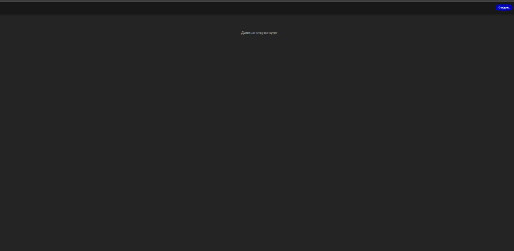
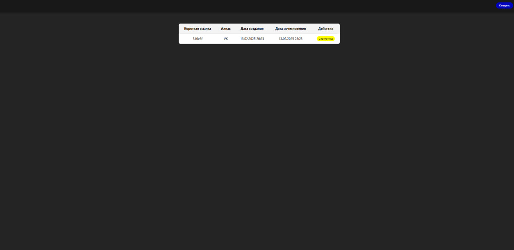
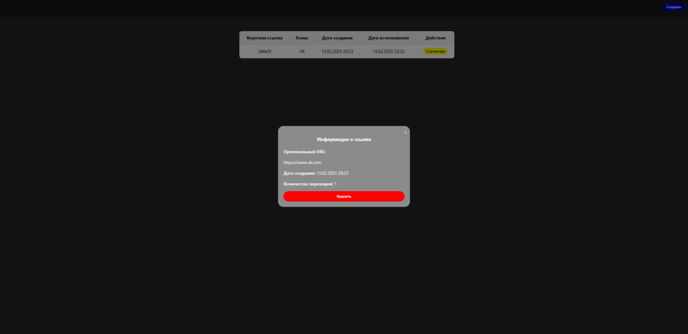

# Установка проекта
Скачайте проект с github командой
`git clone https://github.comTherealkosbruhLinksTestTask.git`

## Установка зависимостей и запуск проекта
+ Измените данные конфигурации БД (PostgreSQL) на свои в файлах `backend/.env` и `docker-compose.yml`
+ В файле docker-compose.yml проверьте разделы`environment`

+ Установите и запустите проект командой в корневой папке проекта (LinksTestTask):
`docker-compose up --build`

## Инструкция пользователя
+ После запуска контейнера откройте приложение по адресу `http://localhost:3001/`
+ Для создания новой ссылки нажмите на кнопку в header "Создать".

+ Для перехода по ссылке нажмите прямо на короткую ссылку.

+ Для открытия общей статистики нажмите на строку с интересующей вас ссылкой. В этот попапе можно вызвать API на удаление данной ссылки из бд.

+ Для просмотра статистики переходов с IP адресами нажмите на кнопку "Статистика".

## Тесты
Все тесты находятся в `/backend/src/tests`
+ Для их запуска в директории `backend` установите зависимости командой:
`npm install`
+ Запустите тесты (файлы .spec) командой:
`npm run test`

